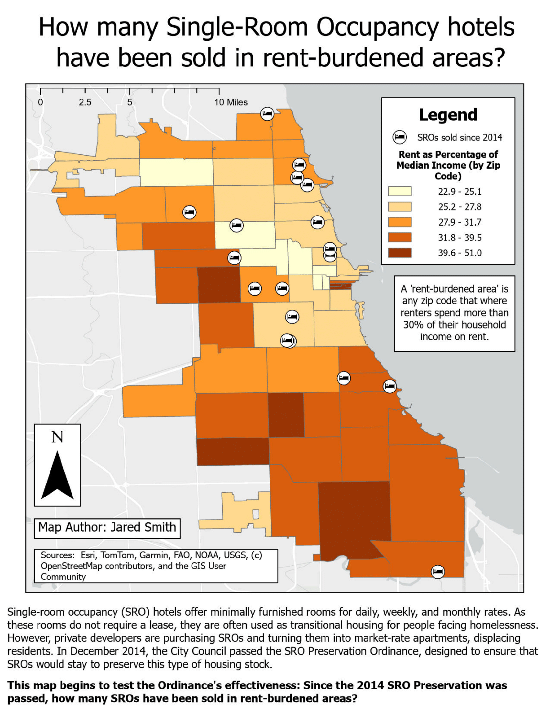

# Project Title

[2-3 sentence description of what this project was about and what you created]

## Methods
[Describe your workflow and technical approach. What did you do step-by-step? What tools/functions/analyses did you use?]

Example structure:
- Data acquisition and preparation
- Analysis steps
- Visualization/output creation

## Skills Demonstrated
- [Skill 1]
- [Skill 2]
- [Skill 3]

## Outputs

## Challenges & Solutions      
[Optional: What problems did you encounter and how did you solve them?]

## Code/Data
[Optional: Link to GitHub repo, data sources, notebooks, etc.]

---
[See all Projects](../project-landing.md)
[Back to Portfolio Homepage](../index.md)
